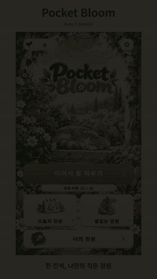
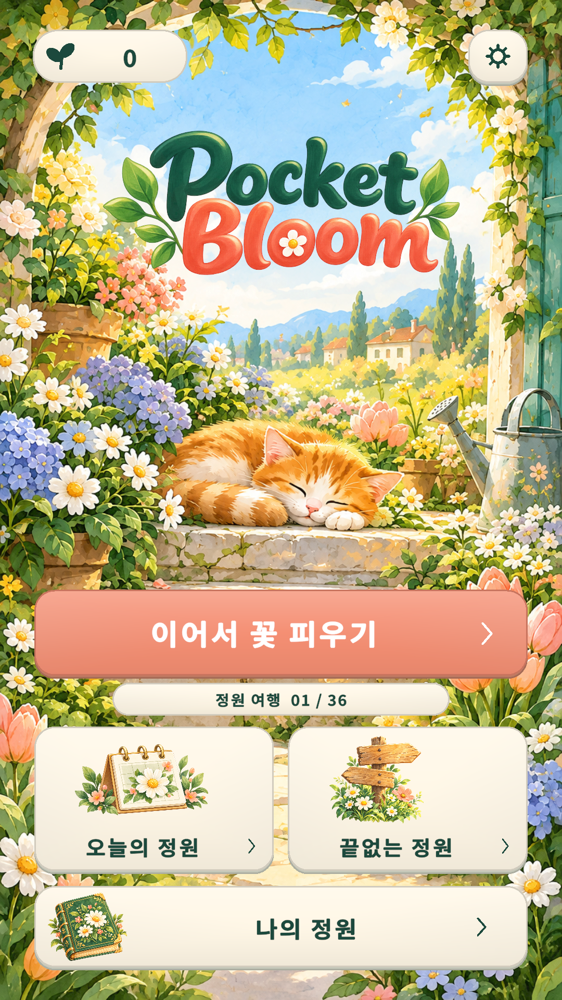
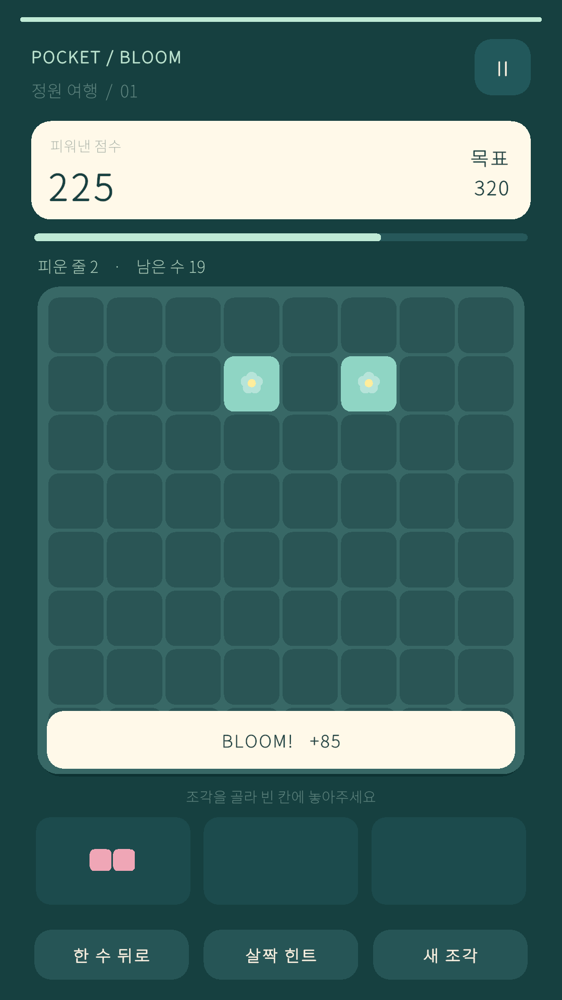
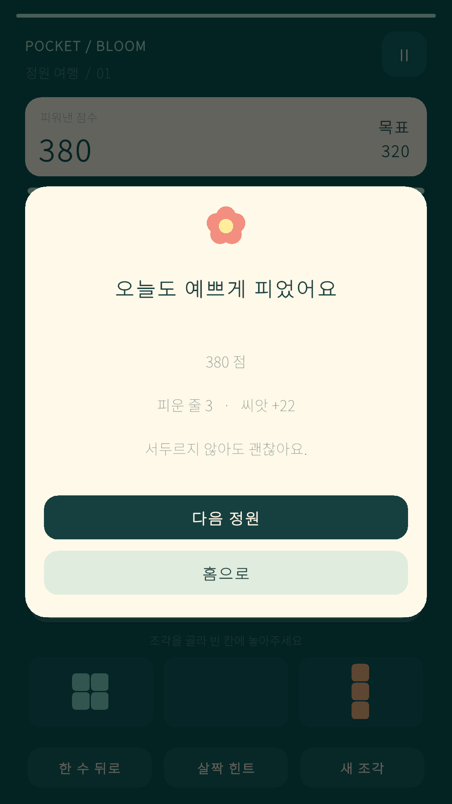
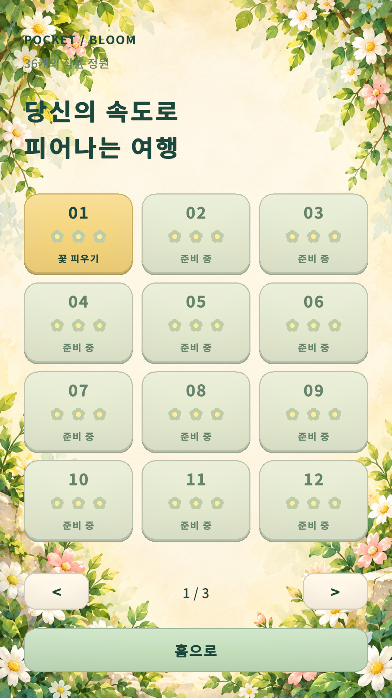
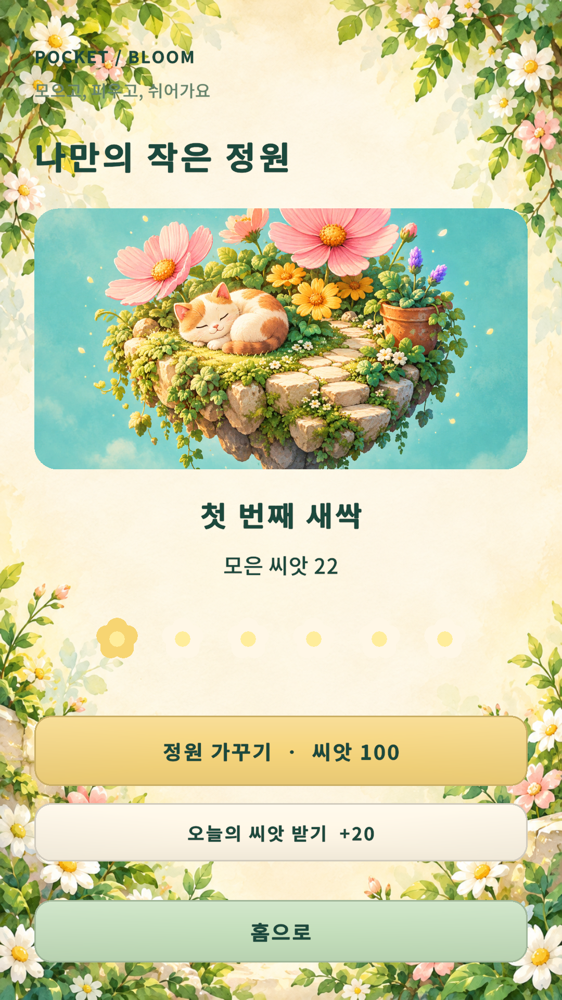
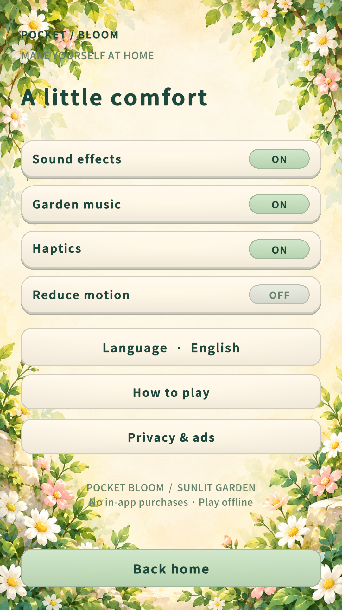

# Pocket Bloom · 포켓 블룸

꽃 블록을 놓아 줄을 완성하고 작은 정원을 가꾸는 세로형 2D 퍼즐입니다. 짧은 한 판부터 36개 정원 여행까지, 터치와 드래그로 편하게 즐길 수 있습니다.

**인앱결제는 없습니다.** 수익화는 선택형 보상 광고와 전면 광고를 기준으로 설계했습니다. 현재 테스트 배포본은 광고 계정이 연결되지 않아 광고가 꺼진 오프라인 테스트 버전입니다.

## 플레이 하이라이트

  

[소리 포함 30초 하이라이트 MP4](https://github.com/Junghyeon0710/Codex-2026-10-04_13-12-56/releases/download/v1.0.0-preview/pocket-bloom-highlight.mp4) · [녹화·편집 과정과 재현 방법](Docs/Media/README.md)

Unity 에디터의 실제 Game View를 녹화하고 컷 편집·짧은 페이드·한국어 자막을 적용했습니다. 실제 게임 음악과 효과음이 들어 있습니다. 자동 터치 입력으로 정상 플레이한 영상이며 Android 실기기 촬영은 아닙니다. GIF는 무음 미리보기입니다.

## 스크린샷

| 홈 | 퍼즐 플레이 | 목표 달성 |
|:---:|:---:|:---:|
|  |  |  |

| 36개 정원 여행 | 정원 컬렉션 | 영어 설정 |
|:---:|:---:|:---:|
|  |  |  |

스크린샷은 동일한 실제 에디터 플레이에서 1080×1920 해상도로 캡처했습니다.

## 다운로드와 실행

[v1.0.0-preview 테스트 릴리스](https://github.com/Junghyeon0710/Codex-2026-10-04_13-12-56/releases/tag/v1.0.0-preview)에 설치 파일과 스토어 자료, 하이라이트 영상이 있습니다.

현재 저장소는 비공개이므로 권한이 있는 GitHub 계정으로 로그인해야 다운로드할 수 있습니다.

| 파일 | 실행 방법과 범위 |
|---|---|
| [Android APK · 약 42MiB](https://github.com/Junghyeon0710/Codex-2026-10-04_13-12-56/releases/download/v1.0.0-preview/PocketBloom-test.apk) | Android 8.0(API 26) 이상 ARM64용. 테스트용 debug 서명이며 실제 단말 설치·플레이 검증은 남아 있습니다. |
| [Windows ZIP · 약 47MiB](https://github.com/Junghyeon0710/Codex-2026-10-04_13-12-56/releases/download/v1.0.0-preview/PocketBloom-Windows.zip) | 모두 압축 해제한 뒤 `PocketBloom.exe` 실행. 빌드는 성공했으며 패키지 직접 조작 검증은 남아 있습니다. |
| [StoreKit ZIP · 약 4MiB](https://github.com/Junghyeon0710/Codex-2026-10-04_13-12-56/releases/download/v1.0.0-preview/PocketBloom-StoreKit.zip) | 배너, 앱 아이콘, 한국어·영어 등록 문구와 원본 자료. |

Unity에서 실행하려면 **6000.6.2f1**로 프로젝트를 열고 패키지 가져오기가 끝난 뒤 `Assets/PocketBloom/Scenes/PocketBloom.unity`를 열어 Play를 누릅니다. 씬을 다시 생성할 때는 `Pocket Bloom > Create or Update Game Scene` 메뉴를 사용합니다.

## 플레이 방법과 콘텐츠

1. 아래의 꽃 조각을 빈 칸에 끌어놓습니다. 조각 선택 후 보드 터치로도 배치할 수 있습니다.
2. 가로 또는 세로 8칸을 채우면 줄이 사라지고 점수가 오릅니다.
3. 여행 목표를 달성하고 씨앗을 모아 정원 컬렉션을 채웁니다.

- **정원 여행:** 36단계, 목표 점수·줄 수와 별 기록.
- **끝없는 정원:** 최고 점수에 도전하는 무한 모드.
- **오늘의 정원:** UTC 날짜마다 같은 문제를 제공하는 일일 도전.
- **정원 컬렉션:** 플레이로 모으는 씨앗과 6단계 성장.
- **편의 기능:** 무료 힌트·한 수 뒤로·새 조각, 자동 저장·백업·이어하기.
- **설정:** 한국어/영어, 음악·효과음·진동·동작 감소.

## 구현과 검증

Unity 6, URP, Input System, uGUI/TextMeshPro를 사용했습니다. 퍼즐 규칙은 `Assets/PocketBloom/Core`, 플레이·저장·오디오·광고 어댑터는 `Assets/PocketBloom/Scripts`, 씬 생성·빌드·녹화 도구는 `Assets/PocketBloom/Editor`에 있습니다. LevelPlay SDK는 연결돼 있으며 실제 광고 설정은 비어 있습니다. IAP 패키지와 구매 기능은 사용하지 않습니다.

| 확인 항목 | 결과와 검증 범위 |
|---|---|
| 규칙·광고 보상 처리 테스트 | EditMode 테스트 13/13 통과. 실제 광고 송출을 검증한 결과는 아닙니다. |
| 퍼즐 콘텐츠 | 36단계 승리 경로와 합법 배치 10,000수 확인. |
| UI·입력 | 에디터 화면 흐름, 가상 터치 드래그와 30개 화면·안전 영역 조합 확인. |
| Android 빌드 | ARM64 IL2CPP APK, 오류 0개. debug v2 서명, 16KB ELF·ZIP 정렬 검사 통과. |
| Windows 빌드 | 오류 0개. 에디터 플레이와 패키지 직접 실행 검증은 별도 범위입니다. |
| 플레이 미디어 | 실제 플레이 녹화, 기존 프로필·저장 파일 복원, MP4·GIF 전체 디코딩 검사 통과. |

실기기 성능·물리적 터치, 광고 계정·동의 관리·실제 광고, 출시 서명·AAB와 스토어 등록은 남아 있습니다. 시장 순위와 수익을 입증할 출시 데이터는 아직 없습니다. 자세한 상태는 [완료 여부와 남은 작업](Docs/CompletionAudit.md)과 [검증 기록](Docs/Validation/README.md)에 정리했습니다.

Unity 메뉴 `Pocket Bloom`에서 Windows Preview / Android Test APK / Android Release AAB를 빌드할 수 있습니다. Test Runner에서는 `PocketBloom.Tests`를 실행합니다. [배치 테스트·빌드 명령](Docs/BuildCommands.md)을 참고하세요. 배포 파일은 GitHub Releases에, 소스·문서·미디어는 Git에 보관합니다.

## 기획과 제작 문서

- [게임 기획서](Docs/GameDesign.ko.md): 핵심 규칙, 콘텐츠, 광고 전용 수익화와 출시 계획.
- [광고 계정 생성·연결 가이드](Docs/AdsSetup.ko.md) · [출시 확인표](Docs/ReleaseChecklist.md).
- [아트·글꼴·오디오 출처](Docs/ArtProvenance.md) · [스토어 소개 초안](Docs/StoreListing.ko.md) · [스토어 자료](Docs/Store/README.md).
- [플레이 녹화·편집 방법](Docs/Media/README.md) · [테스트 릴리스 설명](Docs/PreviewRelease.ko.md).
- [커밋 규칙](CONTRIBUTING.md): `Feat:`, `Fix:`, `Build:`, `Test:`, `Docs:` 등의 접두사와 한국어 요약을 사용합니다.
